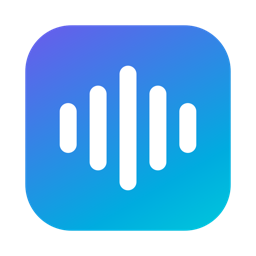

<div align="center">
  
  <h1>Sori (소리)</h1>
  <p>한국어에 최적화된 무료 로컬 macOS 받아쓰기 앱 — <a href="https://github.com/Beingpax/VoiceInk">VoiceInk</a> 포크</p>
</div>

## 무엇이 다른가요

macOS 기본 받아쓰기는 한국어 인식이 부족합니다. Sori는:

- **음성이 기기 밖으로 나가지 않습니다.** Whisper 모델이 Mac에서 직접 실행됩니다 (무료, 오프라인 동작).
- **시스템 전역 단축키**로 어떤 앱에서든 받아쓰기 → 텍스트 입력이 됩니다.
- **한국어 교정 프리셋 내장** — 띄어쓰기·맞춤법·문장부호를 LLM이 다듬어 줍니다 (선택 기능, 본인 API 키 사용).
- 기본 교정 모델은 `claude-haiku-4-5`입니다. 실제 한국어 받아쓰기 시료로 DeepSeek V4 Flash, gpt-oss-120b와 비교 테스트한 결과, 말투(존댓말) 보존과 응답 속도에서 가장 좋았습니다.

## 설치 (빌드된 앱을 받은 경우)

1. `Sori.app`을 `응용 프로그램` 폴더로 옮깁니다.
2. 서명되지 않은 빌드라서 처음 열 때 macOS가 차단합니다. **우클릭 → 열기**를 두 번 시도하거나, 터미널에서:
   ```bash
   xattr -d com.apple.quarantine /Applications/Sori.app
   ```
3. 첫 실행 시 **마이크**와 **손쉬운 사용(Accessibility)** 권한을 허용합니다.
4. 앱의 AI Models 섹션에서 Whisper 모델을 받습니다. 권장:
   - 램 8GB Mac: `Large v3 Turbo (Quantized)` (547MB)
   - 램 16GB 이상: `Large v3 Turbo` (1.5GB)
   - 언어는 **한국어(Korean)** 로 고정하는 것이 인식 품질이 좋습니다.
5. (선택) AI 교정 켜기:
   - Anthropic API 키를 등록하면 기본 모델 `claude-haiku-4-5`가 선택됩니다.
   - 프롬프트 편집기의 템플릿에서 **Korean** 프리셋을 추가·선택합니다.

> 참고: 현재 배포 빌드는 Apple Silicon(M1 이상) 전용입니다. Intel Mac은 아래 "소스에서 빌드"를 따라 주세요.

## 비용과 프라이버시

- 받아쓰기(전사)는 완전 로컬·무료입니다. 네트워크를 꺼도 동작합니다.
- AI 교정을 켜면 **전사된 텍스트만** 선택한 공급자(Anthropic 등)로 전송됩니다. 오디오는 전송되지 않습니다.
- 교정 비용은 본인 API 키로 과금됩니다. Haiku 4.5 기준 받아쓰기 1회당 약 $0.0025 (하루 100회 사용 시 월 $7~8 수준).
- 더 저렴한 대안: 앱의 커스텀 공급자에 Fireworks를 등록할 수 있습니다.
  - Base URL: `https://api.fireworks.ai/inference/v1/chat/completions`
  - 모델 예: `accounts/fireworks/models/gpt-oss-120b` (1회당 약 $0.0007, 단 존댓말 유지가 다소 약함)

## 소스에서 빌드 (개발자)

요구 사항: macOS 14.4+, Xcode(전체 설치), `brew install cmake`

```bash
git clone https://github.com/joonmapo16-bit/sori.git
cd sori
./scripts/build-whisper-macos.sh   # macOS 전용 whisper.xcframework 빌드
make local                          # 앱 빌드 → ~/Downloads/Sori.app
```

`scripts/build-whisper-macos.sh`는 whisper.cpp의 기본 빌드 스크립트가 요구하는 iOS/visionOS/tvOS SDK 없이 macOS용만 빌드합니다. 자세한 빌드 문서는 [BUILDING.md](BUILDING.md)를 참고하세요.

주의: ad-hoc 서명 특성상 **다시 빌드할 때마다** 손쉬운 사용 권한을 다시 등록해야 합니다 (시스템 설정 → 개인정보 보호 및 보안 → 손쉬운 사용에서 항목 삭제 → 앱 재실행 → 허용 → 앱 재시작).

## 업스트림과 라이선스

이 프로젝트는 [Beingpax/VoiceInk](https://github.com/Beingpax/VoiceInk)의 포크이며, 원작의 훌륭한 기반 위에 한국어 기본값·프리셋·문서를 얹은 것입니다. 라이선스는 원작과 동일한 [GPL-3.0](LICENSE)입니다. 빌드된 앱을 전달받으셨다면, 그 소스 코드가 바로 이 저장소입니다.
